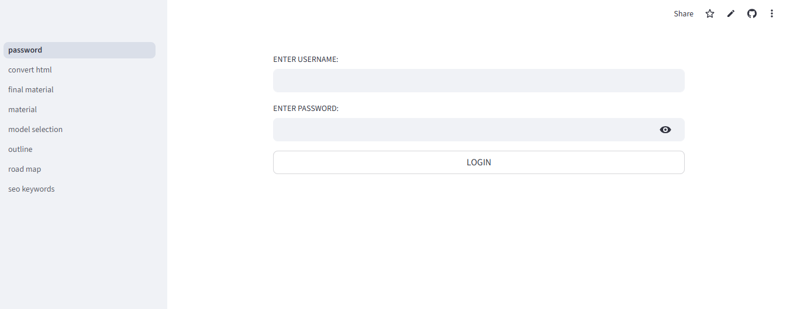
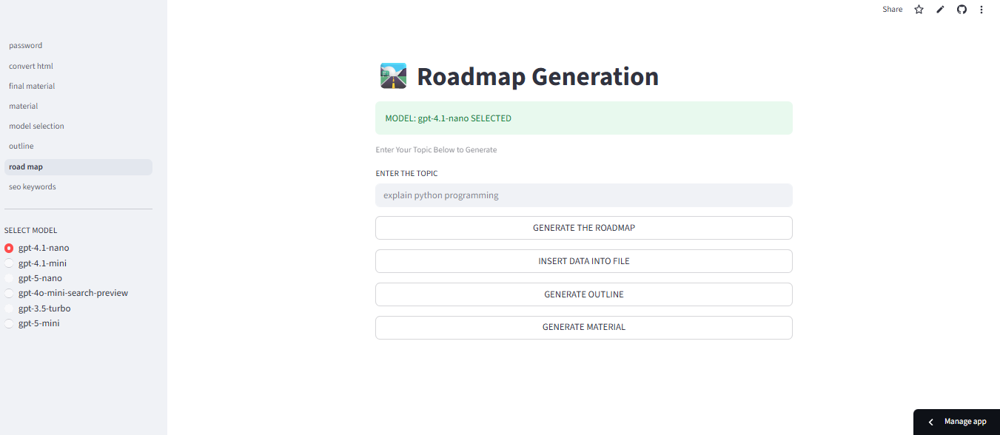
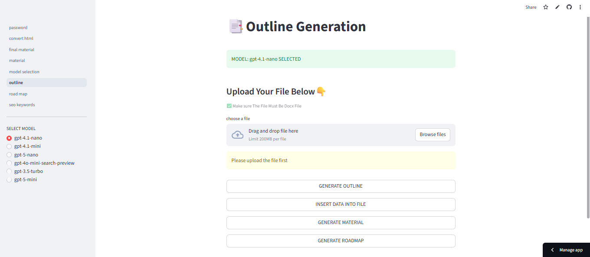
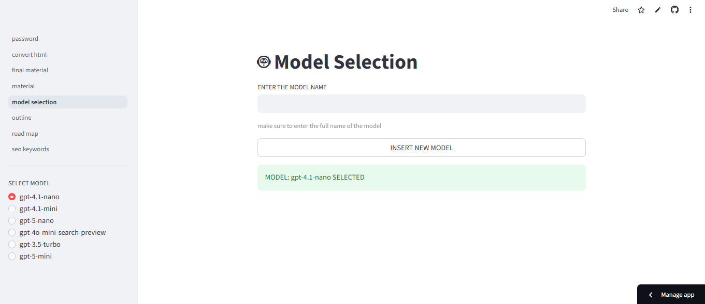
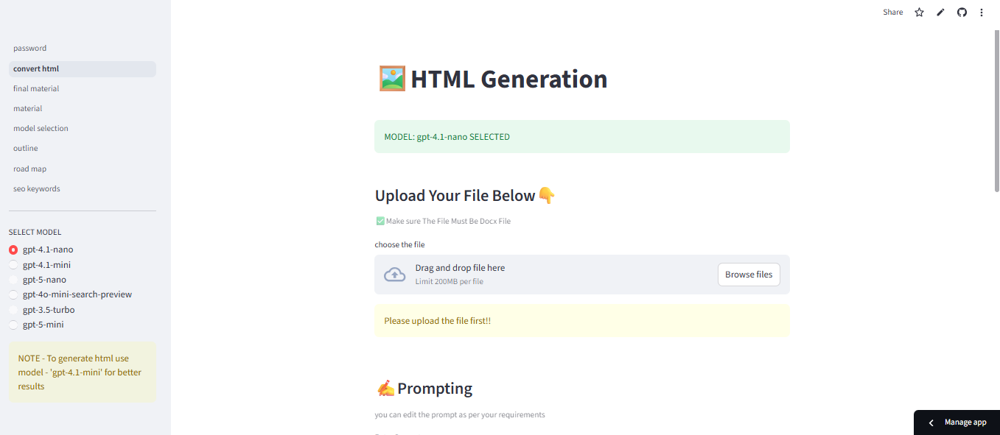

# 📔LANGGRAPH-STUDYMATERIAL-AI-GENERATED

<p align="center"> 
   
</p>

**AI-Generated Study Materials for LangGraph Concepts & Learning Resources**

A curated repository of **AI-generated study material** focused on **LangGraph**, its ecosystem, workflows, core concepts, practical examples, and learning resources. This content is aimed at helping developers, students, and AI enthusiasts understand LangGraph and its applications efficiently.

---
<p align="center"> 
   
</p>

## 🚀 Table of Contents

- [About](#about)  
- [Features](#features)  
- [Motivation](#motivation)   
- [Installation](#installation)  
- [Usage](#usage) 

---

## 📌 About

This repository contains **study material automatically generated using AI** to explain and illustrate topics related to LangGraph — a graph-centric system for building autonomous, stateful, event-driven AI workflows. The goal is to support learners in grasping both foundational and advanced concepts through structured explanations, examples, and references.

---
<p align="center"> 
   
</p>

## ✨ Features

- 🧠 **AI-generated explanations** of key LangGraph concepts  
- 📝 Structured study material for beginners and intermediate learners  
- 🔗 Code snippets and conceptual diagrams (where appropriate)  
- 📚 Curated learning paths and topic breakdowns  
- 🤖 Focused on practical understanding for real-world usage

---

## 💡 Motivation

LangGraph is an emerging paradigm in building reliable agent workflows using graph-based execution. While official docs are comprehensive, many learners benefit from structured summaries, examples, and analogies. This repository aims to bridge that gap using AI-generated material that can be reviewed, improved, and expanded over time.

---
<p align="center"> 
   
</p>
## ⚙️ Installation

To use or explore this repository locally:

1. **Clone the repository**
   ```bash
   git clone https://github.com/droliasakshi12/LANGGRAPH-STUDYMATERIAL-AI-GENERATED.git
   ```

## **🛠️Install Python dependencies**
``` bash
pip install -r requirements.txt
```
<p align="center"> 
   
</p>

## 🧪usage 
- This project helps to create study material using generative ai skills. Made the use of openai model which helps to generate the study material.
- We have make the use of streamlit for better UI interface for the users.
- Multiple pages are created in the pages folder like roadmap , outline , final material , html generation , keyword generation , etc.
- Created a json file to store the model can add the model if required.
- The application can accessed only when you are loggedin else you cannot login.


<b><p>⭐ If you found this repository useful, consider giving it a star!</p>
    <p>Happy Coding 🐍✨</p></b>

<p align="center"> 
   
</p>

👤 Github  : [@droliasakshi12](https://github.com/droliasakshi12)<br>
📩 Email   : sakshidrolia12@gmail.com <br>
🔗 Linkdin : https://www.linkedin.com/in/sakshi-drolia12<br>
<h4>Credits</h4>
<b></b>Future Vision Computer Institute</b><BR>
🌐 Website : https://futurevisioncomputers.com/
<br>
<b><h5>Author</h5></b>
<b>Sakshi Drolia</b>
